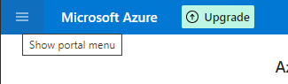
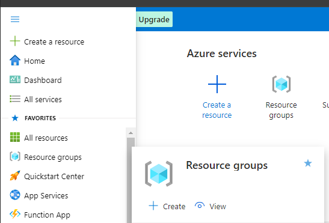

# Create a service connection

## Create a service connection with workload identity federation (automatic) ##
:memo: With this recommended selection, Azure DevOps automatically queries for the subscription and resource group for which we will use the connection.

1. Create first a Resource group
    * Login to https://portal.azure.com
    * 
    * Go to Resource Groups - Create

    

    * Choose a name like  `webapp-studentname-rg` and region `West Europe`
    * Review + Create
    * The resource group should be visible on your subscription

2. Create the Service connection

    * In your Azure DevOps project, go to Project settings > **Service connections**.

    * Select **New service connection**, then select Azure Resource Manager and Next.

    * 

    * Select Workload identity federation (automatic) and Next.
    * 
    
    * Leave scope type to be **Subscription**

:memo: The Azure Subscriptions you own or you are contributor should appear automatically.

    * Select the resource group we created at step 1.

    * Select Grant access permission to all pipelines to allow all pipelines to use this service connection. 

 :memo: If you don't select this option, you must manually grant access to each pipeline that uses this service connection.

    * Select Save.

    * After the new service connection is created, copy the name as this will be the value for `azureSubscription` parameter we will use in next lab.

