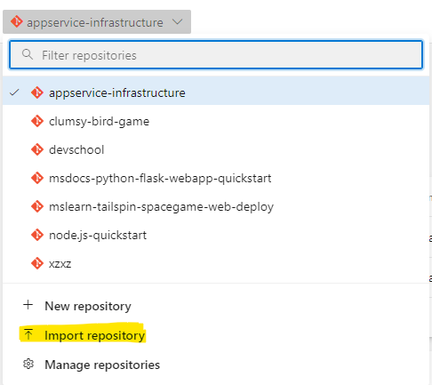
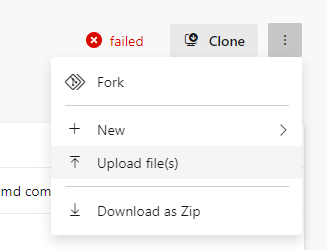
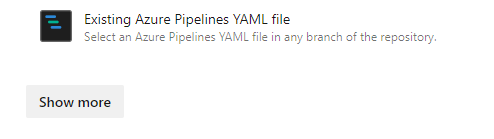
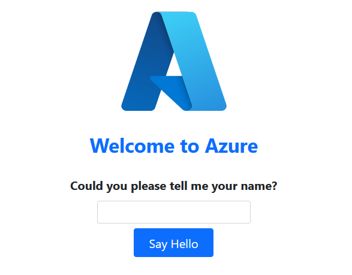

# Deploy Python application to the webapp instances we created previously
## On Day 1 of this course we saw insights on how a python web app deployment looks like
### Let's create ourselves the deployment pipeline

1. Open pipelines repository were lab files are located, you have 2 options:
    - from Github location: https://github.com/devschooldevops/07_08_pipelines
    - from Azure git repo in your project if the above repo was imported in Azure repo
    - Switch to branch **2024**
    - Download the file  `python-pipeline.yml`.
2. Next, go to Azure Devops Repos and check if you still have the imported repo `msdocs-python-flask-webapp-quickstart`
3. If not: 
    * import it by going to Repos - look to the top of your page, you should have your current repo selected
    * Click on arrow to expand the options and choose import repository

    
    * Clone URL: https://github.com/Azure-Samples/msdocs-python-flask-webapp-quickstart

4. Upload downloaded file `python-pipeline.yml` to `msdocs-python-flask-webapp-quickstart` repository by following these steps:
    * go to Files then right tree dots menu
    * Select Upload files from right side

    

    * Browse for `python-pipeline.yml` file and continue
5. Now let's create the Pipeline by going to Pipelines - New pipeline
    * Choose Azure Repo `msdocs-python-flask-webapp-quickstart` 
    * Choose Existing Yaml pipeline...

    

    * Select the path of the file `python-pipeline.yml` and click **Continue**
    * here we must add the 2 missing tasks we discussed in Day 1. Remember them? If not pls ask for help.

    :bulb: Use the task assistant to search for and load tasks in the pipeline, in this way we are sure no property is missed.

6. Run the pipeline targeting **test** webapp instance we created.
7. If results are ok, add another **stage** this time targeting **production** webapp instance.
8. Test the application by browsing the links in the pipeline logs.

How application in browser should look like:

