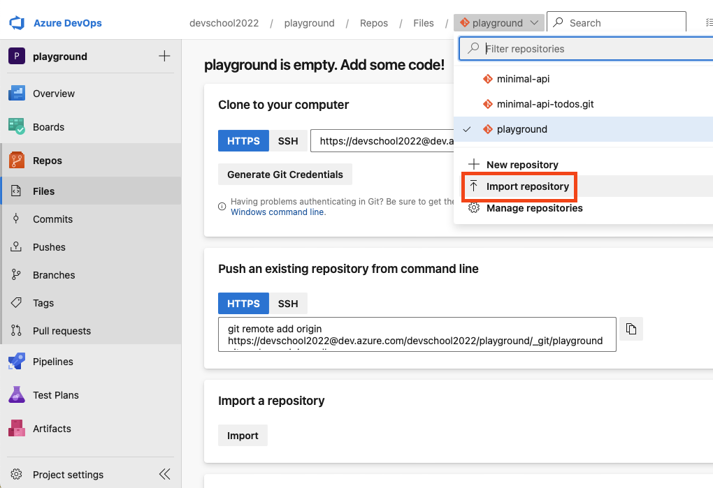
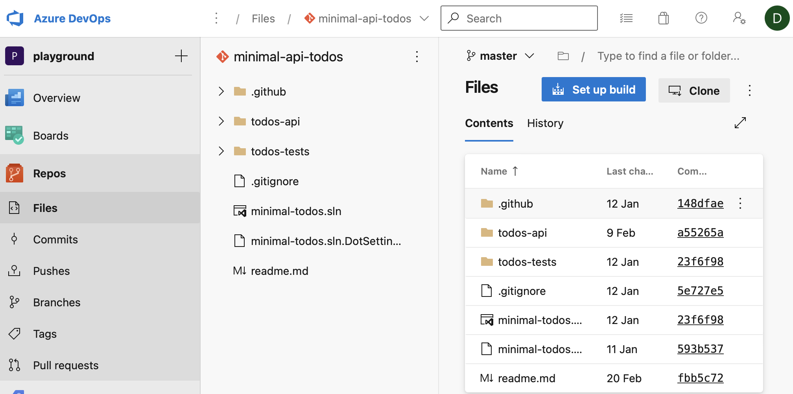
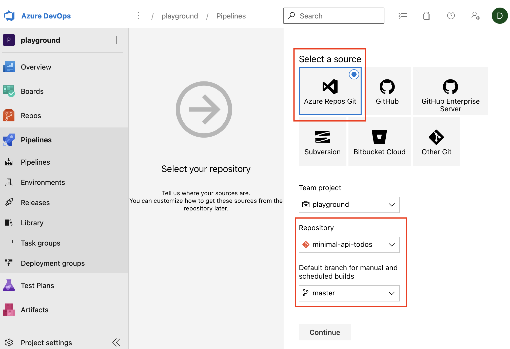
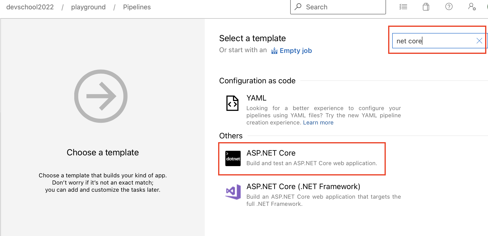

# Classic Build pipeline

[Azure Build pipeline](https://dev.azure.com/devschool2022/playground/_build?definitionId=5)

## Prerequsites

Azure subscription

Local agent running on your machine


## Create a new pipeline

Open [dev.azure.com](https://dev.azure.com) and select your organization on the left site. 

On the top right, click on `+ New Project` and add for `Project name` a value like `MinimalAPI-dot-net` or a different one. Leave the  `Visibility` to Private and click `Create`

 


On the left side select **Repositories** and from the drop down on the top of the page select **Import repository**. 

 

For the **clone url** use the follwing address: 
```
https://github.com/imhotepper/minimal-api-todos.git
```


Wait a while untill the repository is imported.


 

Once imported it should look like the following image:





Select on the left the `Pipelines`, then `Pipelines` again and click on `Create Pipeline`


 


From the opened page, click on `Use the classic editor`


 

On the new window, if the project and repository is already selected then you are all set. If your selection is not as the one in the image below, do the necessary adjustments for and click **Continue**.


 


On the next screen .... **TODO**





On the popup add the link to the public github repository for the jsnoise project without username and passwod : `https://github.com/imhotepper/jsnoise-web-azdo.git`

 


Once added click on continue.

On the top right select `Empty job`.

 

 For the pipeline to run on your own agent, you'll have to click on the `Pipeline` and then on the `Agent pool` select `Default. Then the classic pipeline should look like the one below:

 

 Click on the `+` sign to the right of the `Agent job 1` and on the right side search for `Node.js tool installer` and click on `Add`. Click on the new added item and on the right side set for `Version Spec`: `14.x`. You can also change the `Display name ` so it matches the same version `14.x`


 Click on the `+` sign to the right of the `Agent job 1` and on the right side search for `npm` and click `Add`. Leave it default to install.


 Click on the `+` sign to the right of the `Agent job 1` and on the right side search for `Command line` and click `Add`. Select it and replace the default script with this one: `npm run buil`


 Click on the `+` sign to the right of the `Agent job 1` and on the right side search for `Publish Pipeline Artifacts` and click `Add`. Select the added item and update it for `File or directory path` to `dist`, the `Artifact name` to `website`.


Click on `Save & queue`. 

Make sure in the new window opened that the `Agent pool` selected is `Default` then click on `Save and run`.


Click on the `Agent job 1` to see some logs.


Once the build is finished, return to the previous page and check the artifacts. you should see the website one there.


The website artifact should look something like the following:


**Well done!**

Next will set a trigger for our pipeline so that everytime a new commit to master will be done the pipeline will start automaticaly.

Congratulations! Now you have a new pipeline that will download the code for a single page application and will build it and the result will be published as an `Artifact`.

---
**NOTE**
Maybe:
- variables with replace

---


