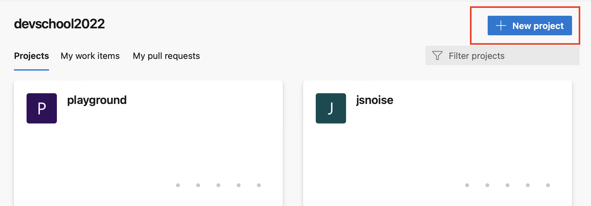
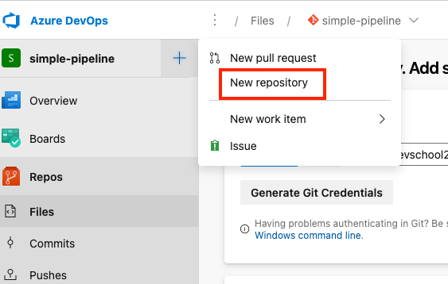
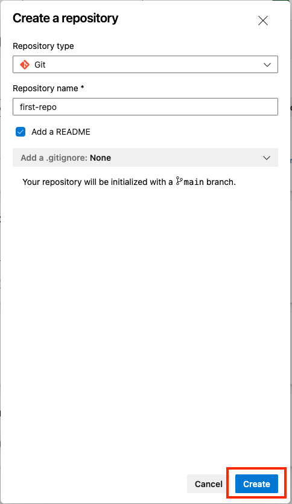
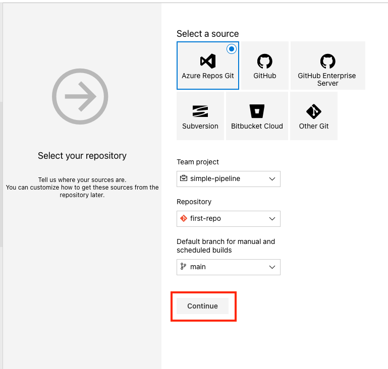
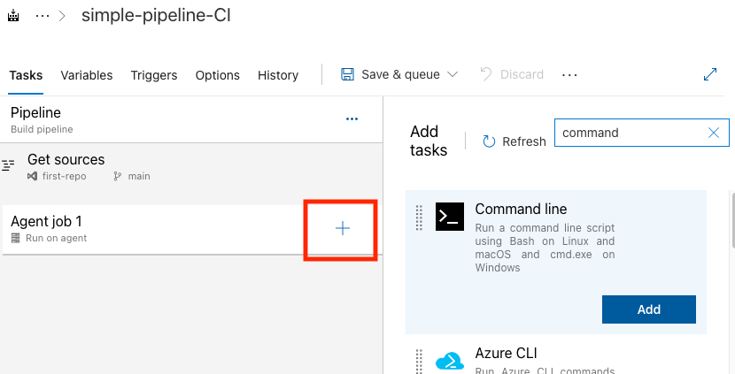
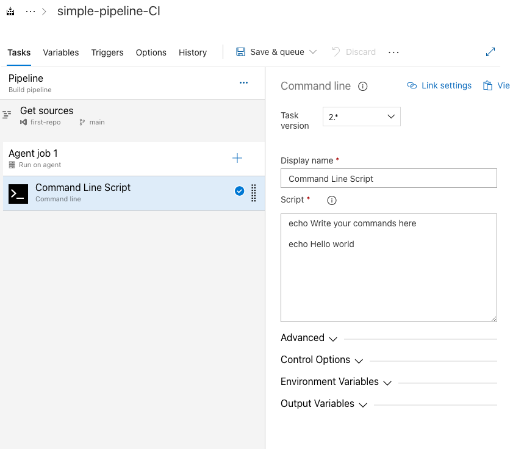
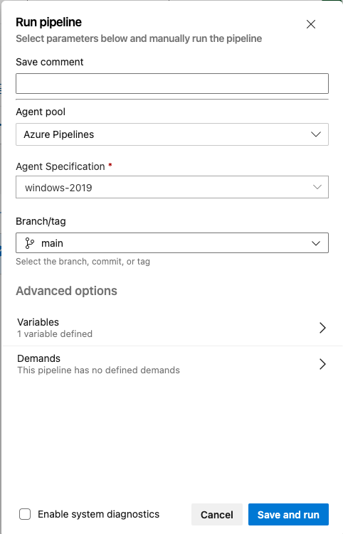
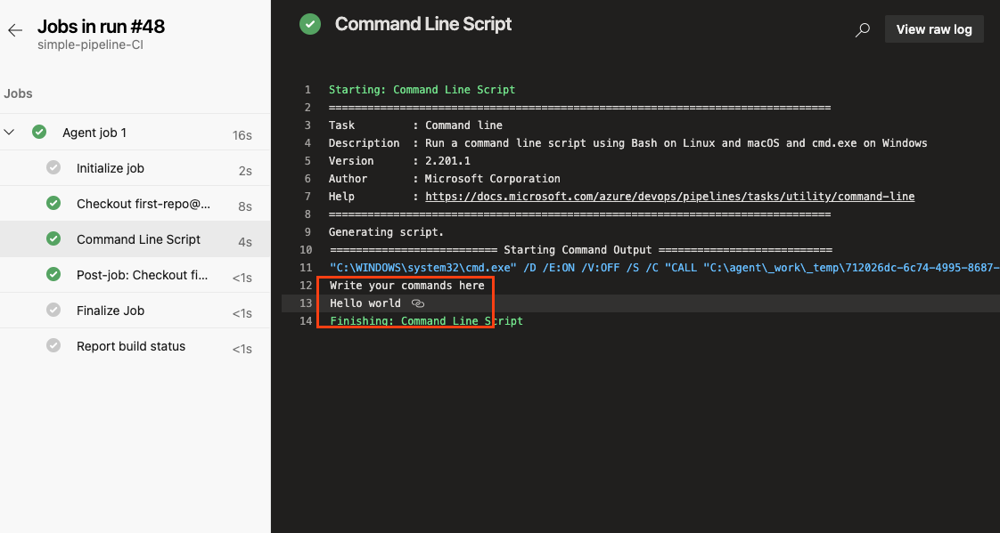

# The simplest pipeline

## Prerequisites

- Azure subscription

- Available Azure Agent/Self hosted agent

  

### Duration: 5' - 10'

 

## Steps

 

###  Create a new repository

 

Open [dev.azure.com](https://dev.azure.com) in your browser and select your organization on the left site. On the top right, click on **+ New Project**.

 

 

Add for **Project name** a value like **Simples-pipeline** or a different one. Leave the  **Visibility** to Private and click **Create**

 

 

 

On the left side bar, click on **Repos** and then on the top left, near the **simple-pipeline** name, click on the **+** plus sign and select **New Repository**.

 

 

 

Add a **Repository name** like **first-repo** and then click **Create**.

 

 

  

###  Create new pipeline

 

Next, on the left side, click on **Pipelines** and then on the button **Create Pipeline**

 

 

 

From the opened page, click on **Use the classic editor**.

 

 

 

Then, select **Azure Repos Git**, for Team project select **simple-pipeline**, Repository **first-repo**, branch **main** or **master** and click **Continue**.

 

 

 

For the template we will choose the **Empty job** from the top.

 

 

 

For the pipeline to run on your own agent, you'll have to click on the **Pipeline** and then on the **Agent pool** select **Default**. If working agents from Microsoft are available you don't have to choose any. Then the classic pipeline should look like the one below:

 

 

 

Click on the **+** sign to the right of the **Agent job 1** and on the right side search for **Command line** and click on **Add**.

 

 

 

Once added, click on the new item **Command line script** and examine the content. The **echo Hello world** will be executed when the pipeline will run.

 

 

 

Make sure the **Agent pool** has the value **Default** selected. Click on the **Save & Queue**, add a comment and click again on **Save and run**.

 

 

 

The next window will show you the status of the pipeline run.

 

 

 

Click in the **Agent job 1** to see the logs and execution of your first pipeline.

 

 

   

---
**NOTE**

 Congratulation for your first pipeline!

---

