# Classic Build pipeline

## Prerequsites

- Azure subscription

- Available Azure Agent/Self hosted agent
 

 

### Duration: 20' - 25'

 

## Create a new pipeline

 
Open [dev.azure.com](https://dev.azure.com) and select your organization on the left site. 

On the top right, click on **+ New Project** and add for **Project name** a value like **JsNoise** or a different one. Leave the  **Visibility** to Private and click **Create**

 

 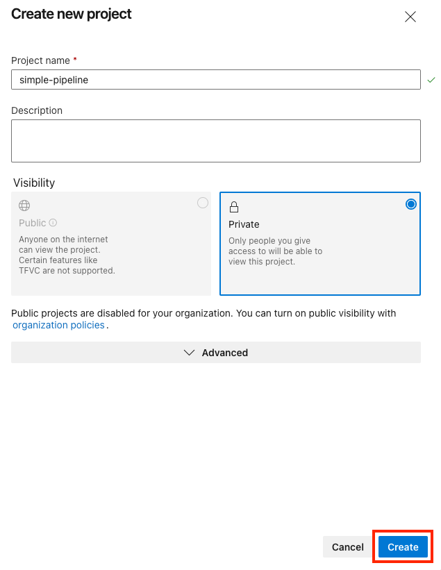

 

Select on the left the **Pipelines**, then **Pipelines** again and click on **Create Pipeline**

 

 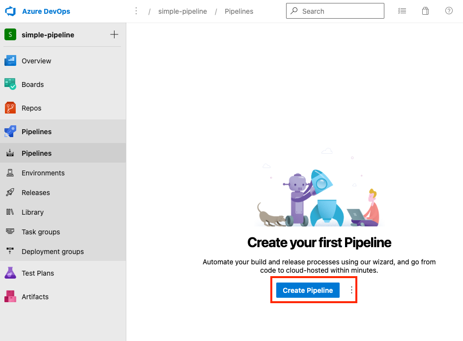

 

From the opened page, click on **Use the classic editor**

 

 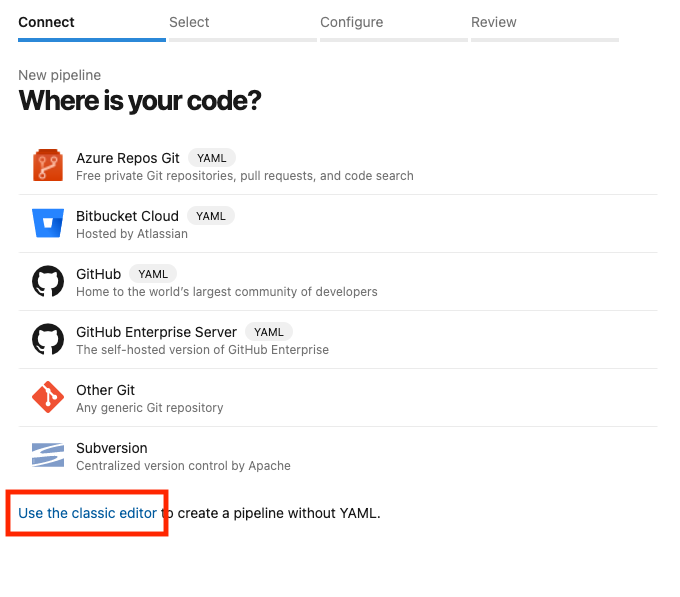

 

On the new window click on **Other Git** and on **Add connection**. 

 

 

 

On the popup add the link to the public github repository for the jsnoise project without username and passwod : **https://github.com/imhotepper/jsnoise-web-azdo.git**

 

 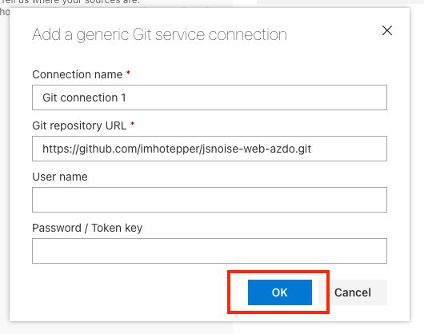

 

Once added click on continue.

On the top right select **Empty job**.

 

 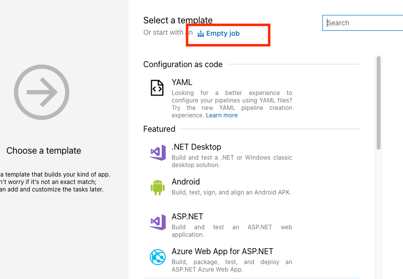

 

 For the pipeline to run on your own agent, you'll have to click on the **Pipeline** and then on the **Agent pool** select **Default**. After the selection, the classic pipeline, should look like the one below:

 

 

 

 Click on the **+** sign to the right of the **Agent job 1** then, on the right side search for **Node.js tool installer** and click on **Add**. Click on the new added item and on the right side set for **Version Spec**: **14.x**. You can also change the **Display name ** so it matches the same version **14.x**

 

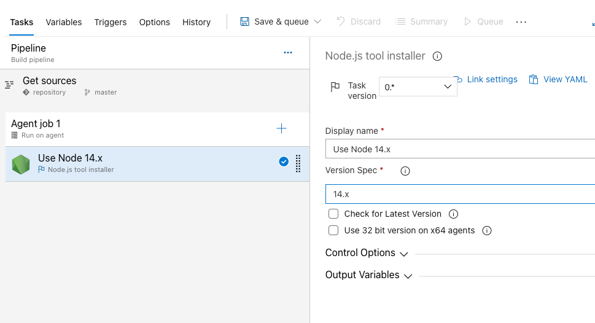

 

 Click on the **+** sign to the right of the **Agent job 1** and on the right side search for **npm** then click **Add**. Leave it default to install.

 

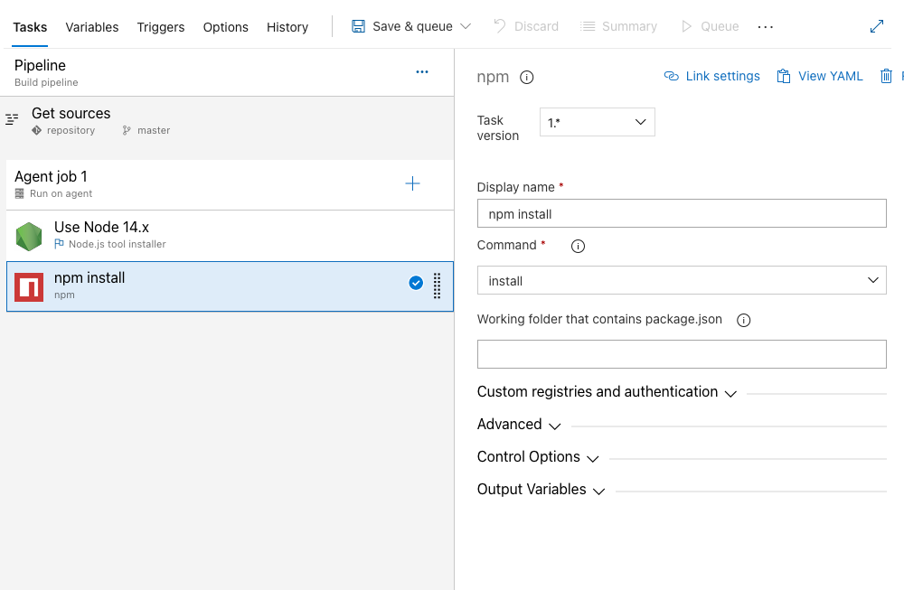

 

 Click on the **+** sign to the right of the **Agent job 1** and on the right side search for **Command line** then click **Add**. Select it and replace the default script with this one: **npm run build**

 

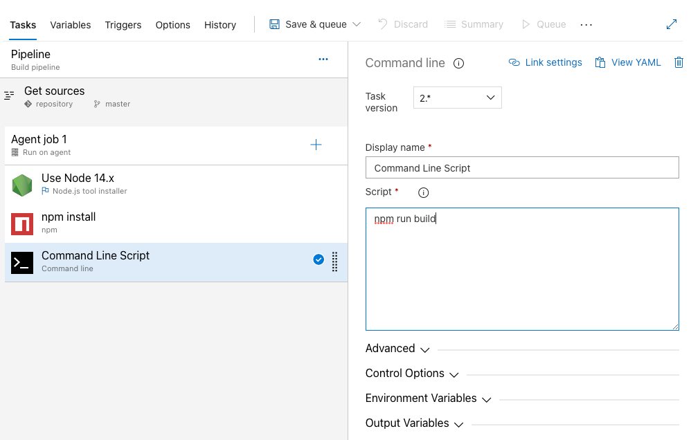

 

 Click on the **+** sign to the right of the **Agent job 1** then on the right side search for **Publish Pipeline Artifacts** and click **Add**. Select the added item and update it for **File or directory path** to **dist**, the **Artifact name** to **website**.

 

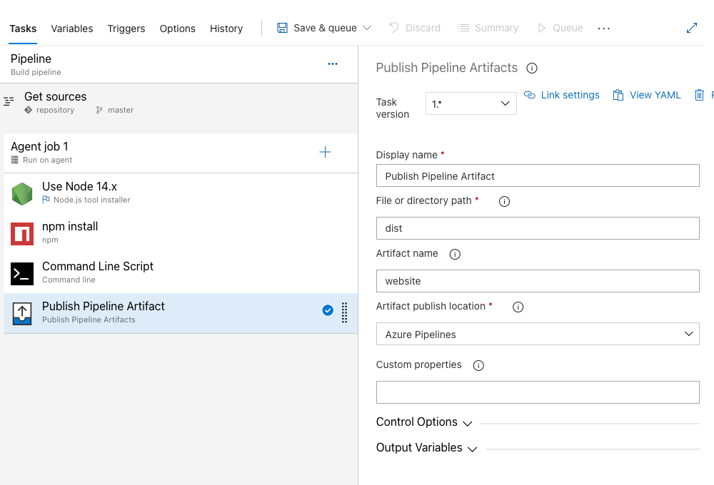

 

Click on **Save & queue**. 

Make sure in the new window opened that the **Agent pool** selected is **Default** then click on **Save and run**.

 

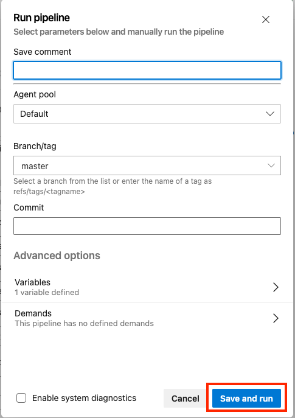

 

Click on the **Agent job 1** to see some logs.

 

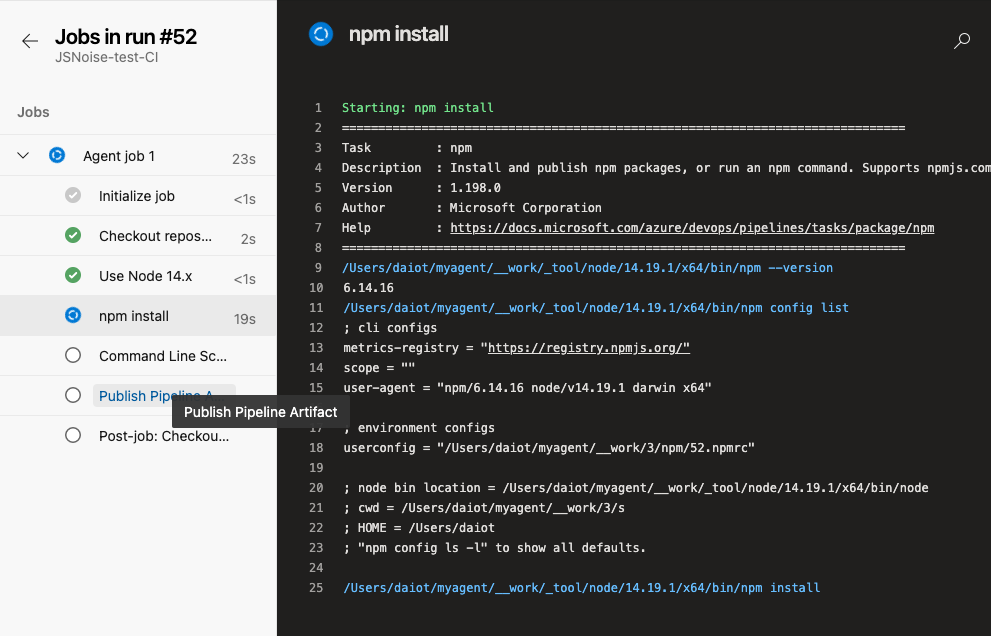

 

Once the build is finished, return to the previous page and check the artifacts. You should see the website one there.

 

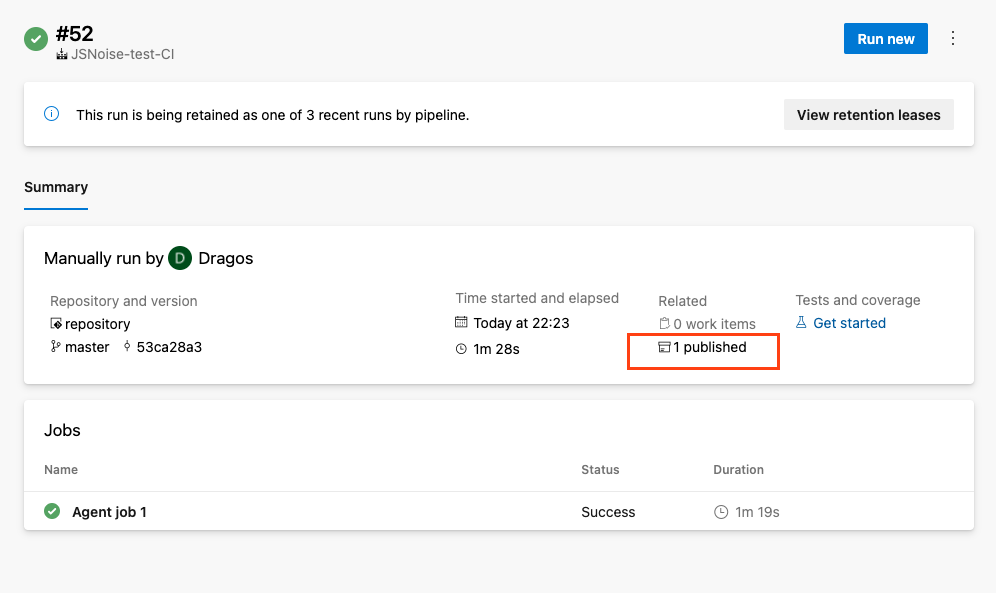

 

The website artifact should look something like the following:

 

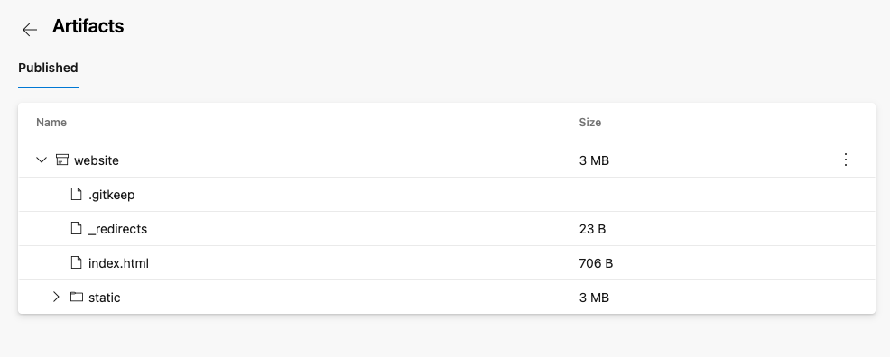

 

**Well done!**

Next will set a trigger for our pipeline so that everytime a new commit to master will be made the pipeline will start automaticaly.

 

Open the **Pipelines** menu on the left side and select your new pipeline. Click on the **Edit** button and then on the **Triggers** tab. On the opened page, click on the **Enable continuous integration** then **Save & queue** your changes. Now, every time a change will be made to the original sources the build pipeline will be triggered.

 

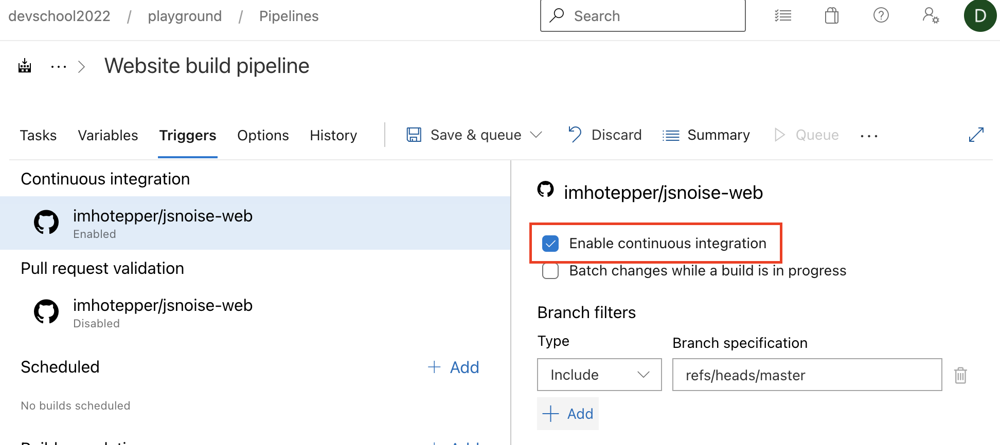

   

---
**NOTE**

Congratulations! You now have a new pipeline that will download the code for a single page application, will build it and the result will be published as an **Artifact**.

---

