# Classic Release pipeline


## Prerequisites

- Azure subscription

- Available Azure Agent/Self hosted agent 

<br>

### Duration: 10' - 15'


## Steps

### Stage 1

<br>

Navigate to your organization page: https://dev.azure.com/[your-organization-name], select your project and then click on **Pipelines** on the left side menu or as shown in the image below. 

<br>

 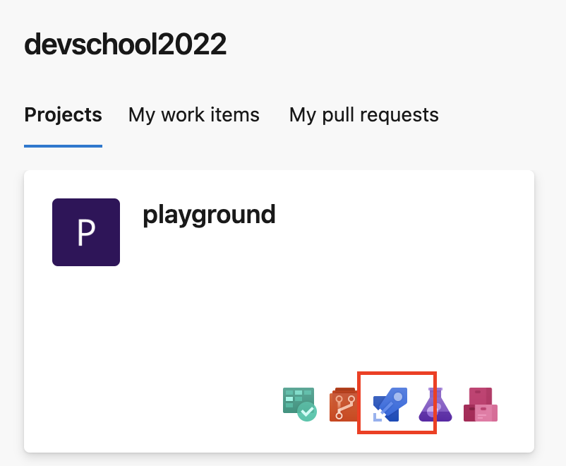

<br>

Select the **Releases**  and click on  **New pipeline**.

<br>

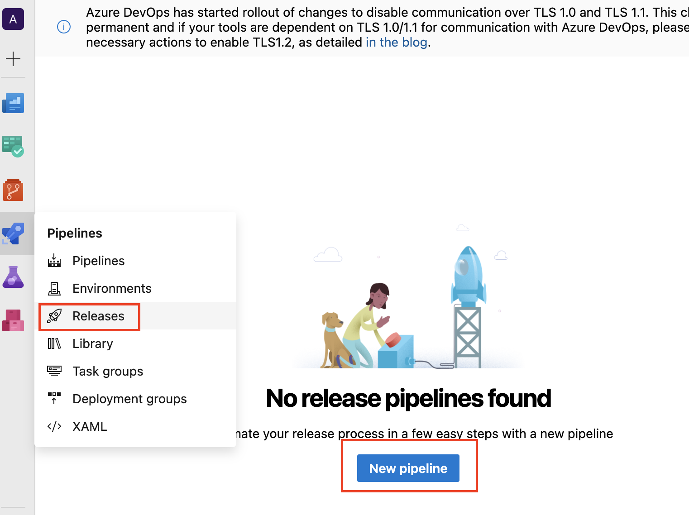

<br>

Click on the **Empty job**.

<br>

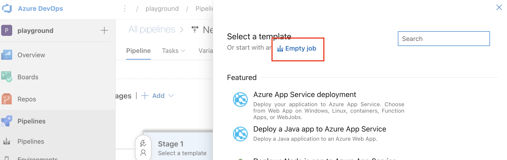

<br>

Close the details window and the result should look like the following:

<br>

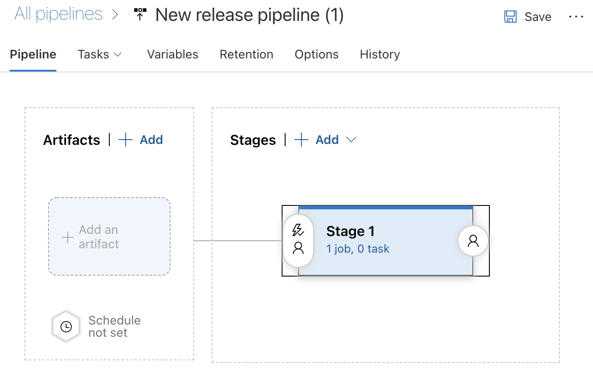

<br>

On the screen, click on the **+ Add an artifact** and select your project and the build pipeline from the dropdown as a source. Replace **Source Alias** to **website**. Click **Add**.

<br>

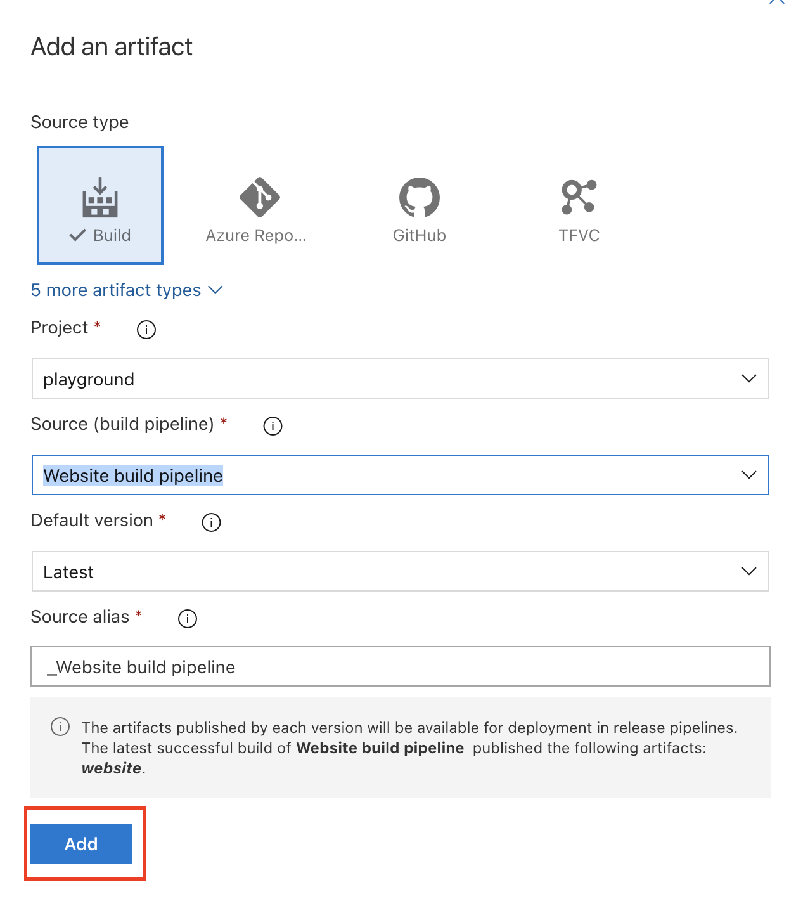

<br>

Click on the link below the Stage name.

<br>

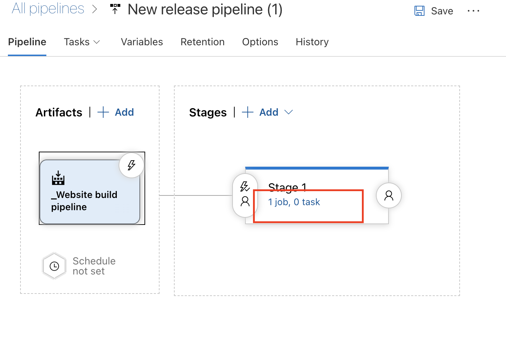

<br>

Select **Agent job** and click on the **+** sign. 

<br>

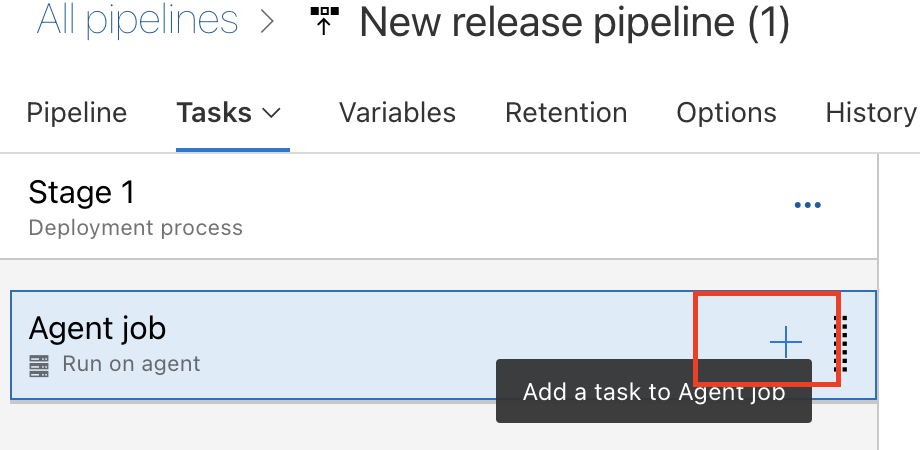

<br>

On the new window, in the search box type **Command** and select **Command line** from the found items. Click on **Add** to insert it in the release.

<br>

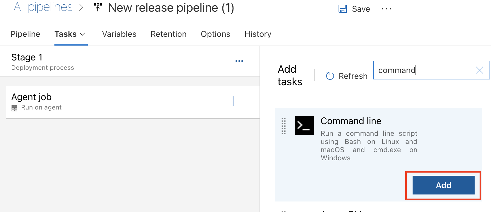

<br>

Select the newly added command and replace the script input with the following one:

<br>

```cmd
az storage blob directory upload -c '$web' --account-name $(account-name) -s "website/website/*" -d . --recursive --account-key $(account-key)

```

<br>

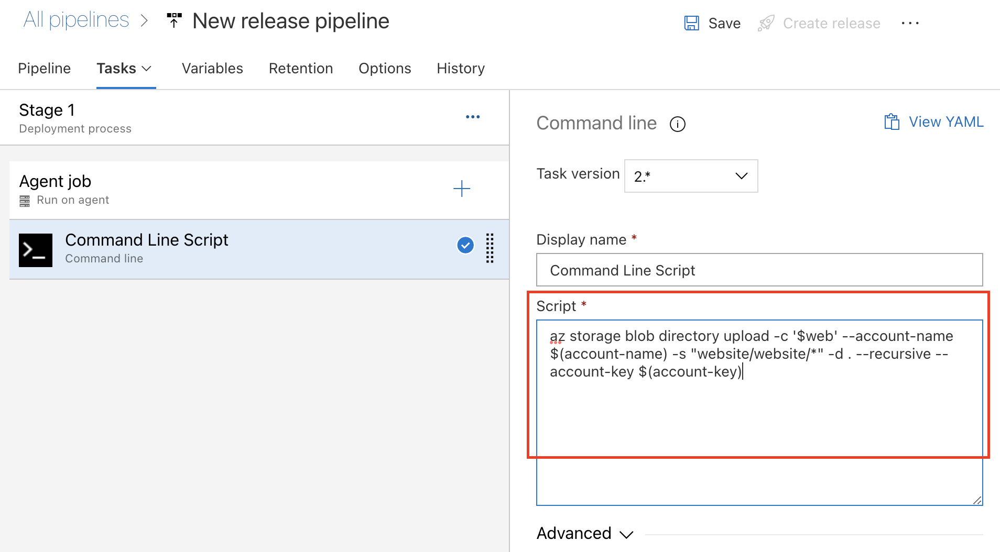

<br>

In the above lines, we have 2 Variables: **account-name**  and  **account-key** that will be replaced at execution time, with the values from the **variables**.


Let's define the variables by clicking on the **Variables** tab on top of the page.


Add the following variables **account-key** and **account-name** with the values provided. To make the values a secret that will no be shown in the logs, just click on the lock icon near the added value. The result should look like the image below.

<br>

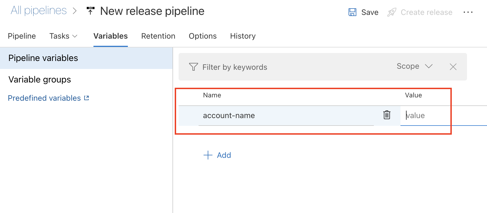

<br>

Save the Release pipeline with a name (website-release-pipeline).

<br>

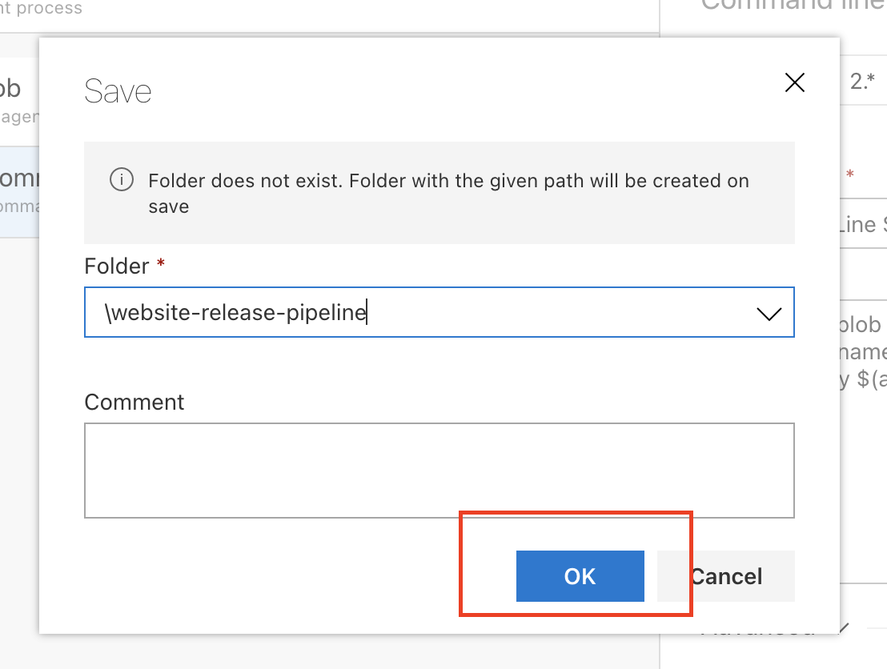

<br>

Next, click on **Create release** and then **Create**.  Wait for the pipeline to run.

<br>


<br>

Once it executed with success, then you should be able to navigate to the povided url to see the website deployed and running.

The result should look similar with the following:

<br>

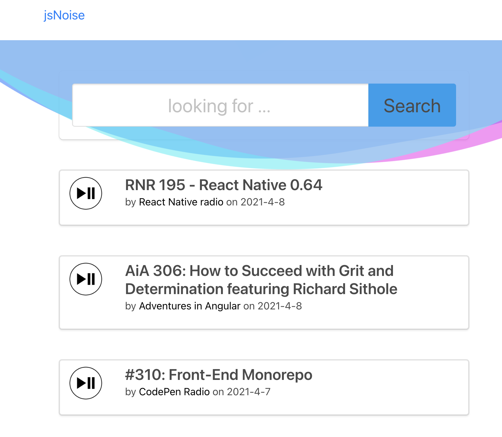

<br>

### Stage 2

<br>

In this stage we will add another stage/environment. Open your release pipeline and move the mouse over the ** Stage 1 ** block, then click on the **copy/clone** button.


<br>

After clone a new stage will be added. You can click on the name and rename it to **Stage PRD** as an example.

<br>


<br>

Next, we'll add a **Pre-deployment approvals** so that the pipeline Stage will not be executed unless it is approved! Click on the user icon on the second stage.

<br>


<br>

On the new window toggle the **Pre-deployment approvals** and add your user in the list. Save it and run the pipeline again. Don't forget to use the **Deploy** button on the first Stage if is not starting.


<br>

Once the first stage is executed you'll be asked for an approval on the second one. Click on the **Approve** so that the release will start. 

<br>


<br>

With the approval in place, your pipeline will be more secure and the risk of deploying unwanted code to Production will be mitigated.

<br><br><br>


---
**NOTE**

Congratulation!!! You finished the release pipeline and deployed to Azure a working website!

---

